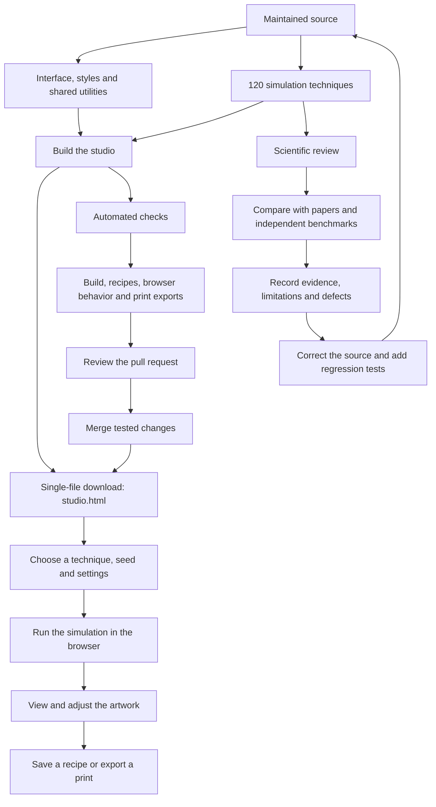

# Project flow

The maintained source is modular. The generated download remains one HTML file.

Passing automated checks does not mean all techniques are scientifically validated. The
[validation inventory](VALIDATION.md) records coverage; [BUILDING.md](BUILDING.md) explains
assembly, and [CONTRIBUTING.md](CONTRIBUTING.md) explains contribution and review.
