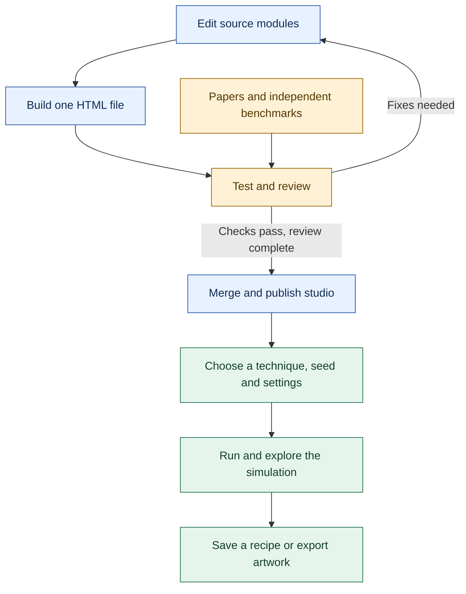

# Project flow

The maintained source is modular. The generated download remains one HTML file.

Passing automated checks does not mean all techniques are scientifically validated. The
[validation inventory](VALIDATION.md) records coverage; [BUILDING.md](BUILDING.md) explains
assembly, and [CONTRIBUTING.md](CONTRIBUTING.md) explains contribution and review.

## Reading the flow

- **Blue:** contributors edit modular source, build the portable HTML, and publish reviewed changes.
- **Amber:** tests exercise covered behavior; papers and independent benchmarks support specific scientific claims. Failures lead back to source corrections.
- **Green:** users choose inputs, explore a simulation, then keep a recipe or an exported image.

A recipe stores inputs; an image stores pixels. Keep the studio version with a recipe when you need to reproduce a historical result. Print dimensions do not increase a simulation's underlying numerical resolution.
