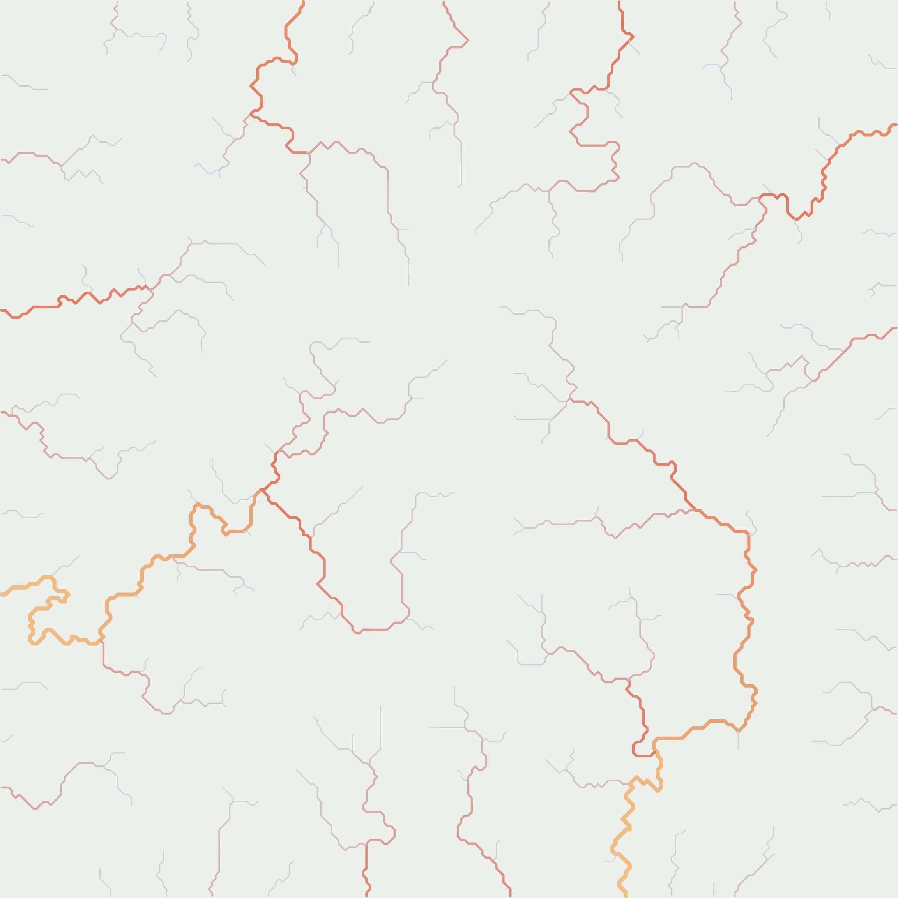
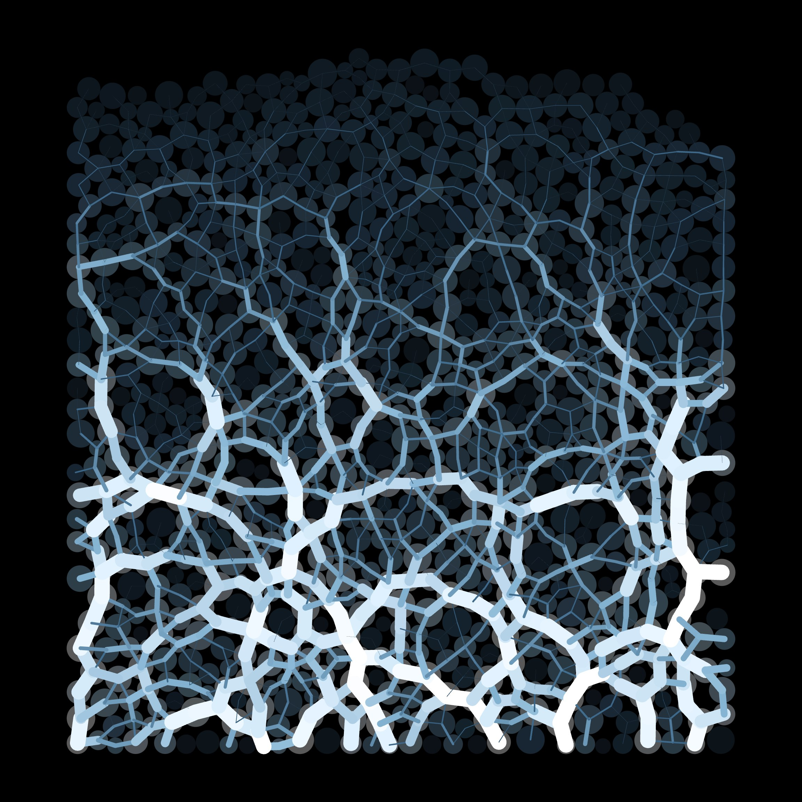
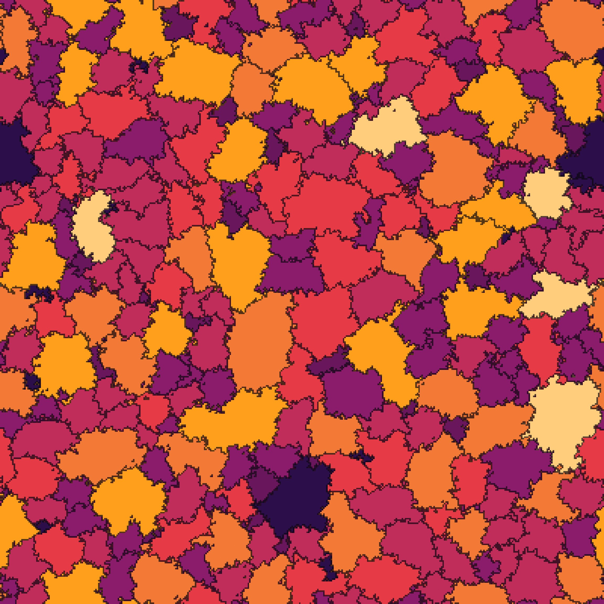
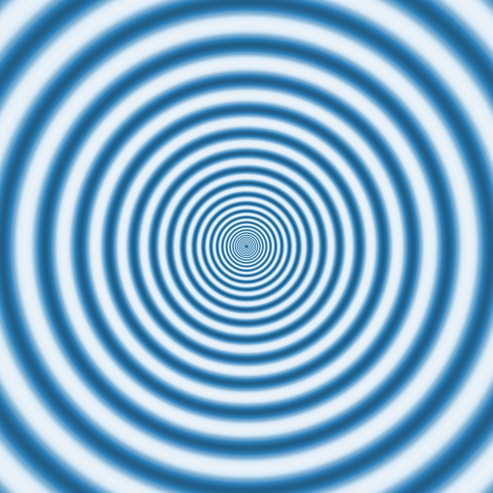
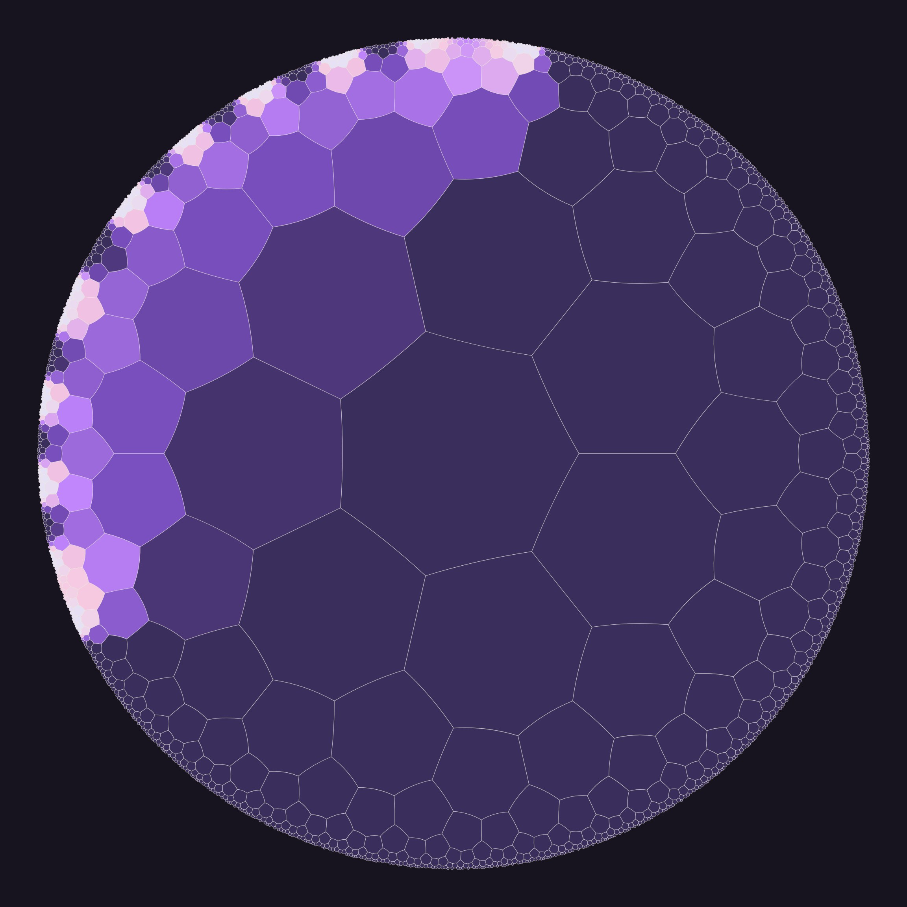
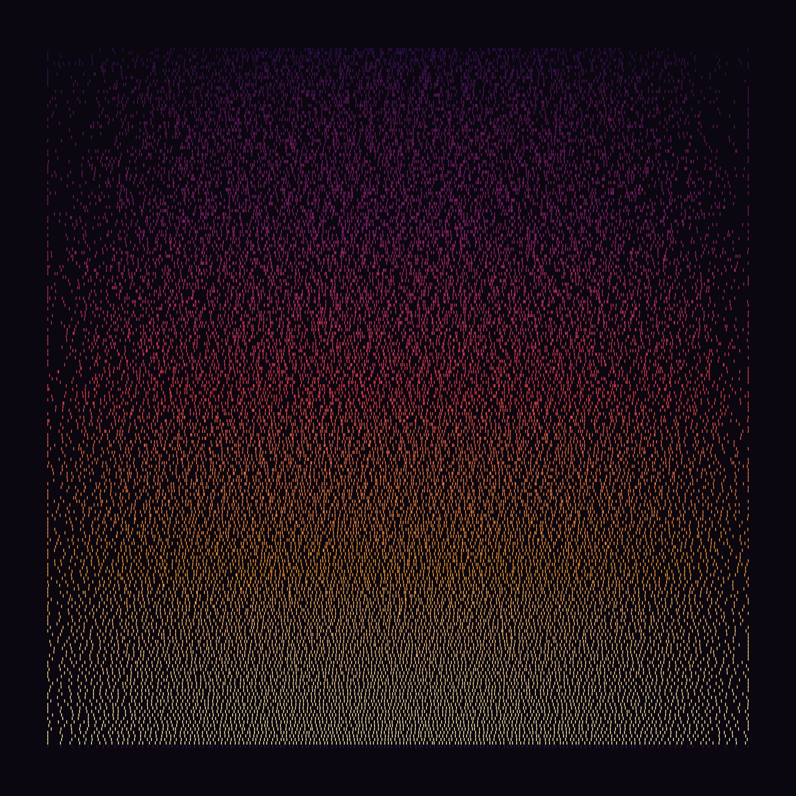
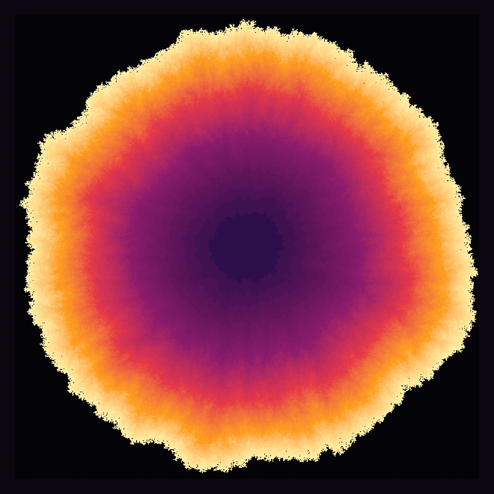
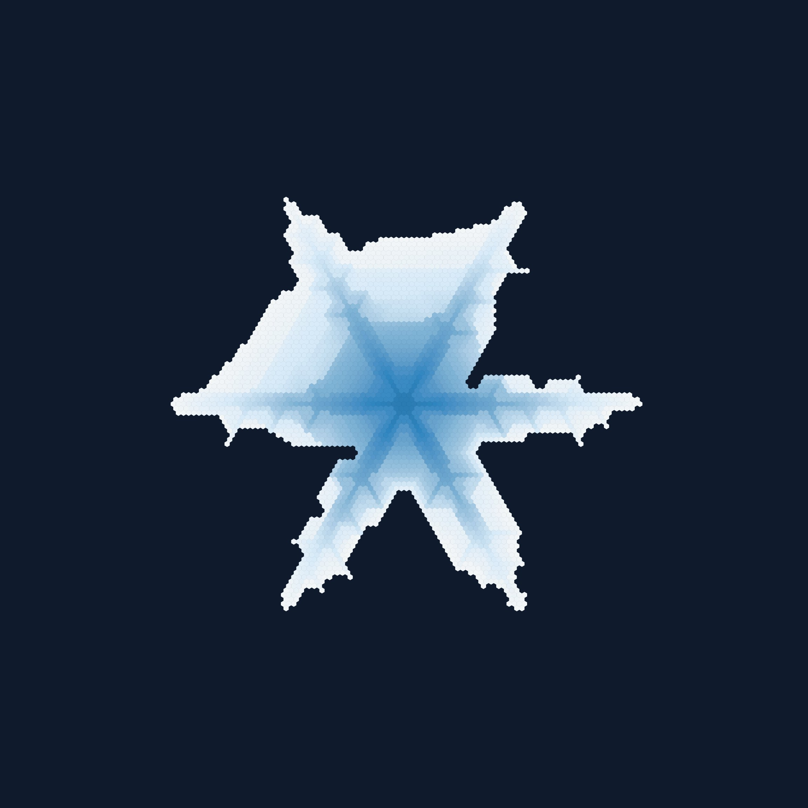
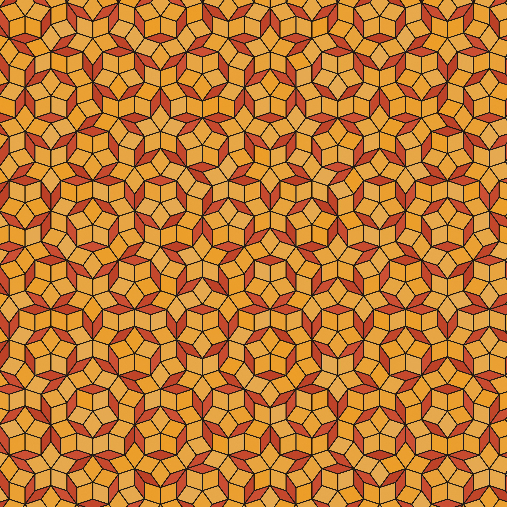

# GENChase

**Gen art, print ready.**

Generative art from real scientific simulations, built to leave the screen. Every plate is seeded and exports in inches at a chosen pixel resolution. Numerical resolution and validation coverage vary by simulation; see [VALIDATION.md](VALIDATION.md).

One portable HTML file, maintained as modular source. 122 pattern-forming systems with saved recipes and print exports.

<p align="center">
  
  
  
</p>
<p align="center">
  
  
  
</p>
<p align="center">
  
  
  
</p>
<p align="center"><sub>Howard stream power · Cundall-Strack · Graner-Glazier · Ermentrout-Cowan · Gray-Scott on {7,3} · Dumitriu-Edelman · Eden · Gravner-Griffeath · Penrose. Frames from the live studio, at print resolution.</sub></p>


Every tab is a system that already exists in a paper: Gray–Scott chemistry, Physarum transport, Lenia, Navier–Stokes, Cahn–Hilliard spinodal, Swift–Hohenberg convection, Lifshitz–Petrich 12-fold quasicrystals, Gravner–Griffeath snow crystals, hat and spectre monotiles, Helmholtz scars, optical caustics, Barkley excitable media, the Ising model, Bak–Tang–Wiesenfeld sandpiles, Schrödinger wave packets, Rayleigh–Bénard convection, the arctic circle of random domino tilings, Schramm–Loewner curves, and the rest. The governing equations are the medium. Nothing here is a style filter sitting on noise.

A seed plus its parameters is the piece. Saved recipes preserve seeds and parameters; numerical results can still depend on precision, platform and simulation resolution. The URL hash carries the recipe. Export is sized in inches at print resolution, with an optional colophon printed under the image, carrying the technique, the equation, the seed and every parameter, the way a scientific plate used to carry its method.

Images you generate are yours, whoever you are. Sell them. The source is [Apache-2.0](LICENSE), open to forks, modifications, redistribution and commercial use. See the separate [output grant](OUTPUT-RIGHTS.md). A real vulnerability: [SECURITY.md](SECURITY.md), privately, not as a public issue.

---

## Why this exists

GENChase brings many scientific models into one workspace for exploring patterns and making prints. A shared interface provides seeds, saved settings, palettes and export controls, so each simulation does not need its own application.

The download runs locally. A saved recipe records the inputs needed to reconstruct a piece; its exact pixels can still depend on software version, numerical precision and hardware.

> [!IMPORTANT]
> **Current research status: zero confirmed novel findings thus far.**

Another purpose is mathematical discovery: explore simulations, spot relationships, and develop new identities, formulas, and sharp bounds. The aim is to discover and invent new mathematics, then test the results, prove what we can, and check the literature before claiming originality. The [research notes](IDENTITIES.md) record derivations, and the [literature audit](identities/NOVELTY-AUDIT.md) documents the source checks.

The [module research notes](research/MODULE-RESEARCH.md) compare useful additions from scientific
software and explain the possible MathMod connection. New visual designs and larger simulations
are opportunities to investigate; they do not by themselves establish new mathematics.

| Workflow | What you keep | What is needed to reproduce it |
|---|---|---|
| 🔵 **GENChase** | Portable studio and a saved recipe | Studio version, seed, settings and a compatible browser |
| Custom code project | Source and chosen dependencies | Code, inputs, random seed and environment |
| Image-generation workflow | Output and any saved generation settings | The model/version and available reproducibility controls |
| Rendered video | Finished frames | The file reproduces playback; the underlying simulation requires its source and inputs |

---

## What is actually different

**The assembly.** The tabs implement models drawn from the papers they name, with validation coverage recorded separately. Chemistry, acoustics, liquid crystals, and aperiodic tiles share one seed field, one palette, and one export. Switching from Cahn–Hilliard to Chladni costs you nothing.

**Determinism as the product.** Every random draw comes from a seeded generator. Vector geometry can scale to print dimensions. Grid simulations retain their numerical resolution when exported; increasing print size does not refine the solution.

**The hash is the recipe.** `#snowflake/gravner-2008` and `#lp/lifshitz-1997` are enough to reconstruct a plate. Settings JSON is another way to save inputs. Current recipes use version 2; older recipe versions are handled by declared compatibility defaults.

**Print first.** The size control speaks inches and centimetres as well as pixels. Choose a preset or enter a custom width and height in inches, then choose pixel density to suit the printer and intended viewing size. Custom sheets fit the complete artwork with background margins, preserving its proportions. Colophon on: a mounted sheet. Colophon off: the image alone. Where the medium is lines, export can be SVG, not a photograph of pixels.

**An activity indicator.** The LIVE badge detects changes in canvas pixels. It helps show whether a plate is changing or still; it does not prove that a simulation is numerically correct or distinguish simulation frames from every other kind of animation.

**Nothing to phone home.** No installation or build is needed to use the download. No account, analytics or CDN is required. WebGL2 where the method needs a GPU, CPU where that is faster. It runs from a folder.

---

## What the checks establish

Two additions offer larger optional workloads:

| Technique | Explore | Larger setting | Scientific scope |
|---|---|---|---|
| **Maxwell FDTD** | Electric and magnetic waves scattering through dielectric patterns | Up to 2048 × 2048 cells for a square GPU field | Lossless, periodic, two-dimensional model; [numerical and print evidence](validation/MAXWELL.md) |
| **Molecular Dynamics** | Attractive and repulsive particles in a periodic box | Up to 16,384 particles on the CPU | Two-dimensional force-shifted Lennard–Jones model; [trajectory and print evidence](validation/MOLECULAR.md) |

The larger settings are optional and may be slow. More computation does not automatically establish
more accurate science. Maxwell prints interpolate its chosen numerical grid; molecular prints
preserve the current particle geometry, including vector export.

The [experiment reports](experiments/README.md) retain failed hypotheses and numerical limitations alongside a boundary-effect diagnosis and a preliminary disorder-spreading signal. None establishes a novel finding. A Python analysis tool fits and tests held-out coarsening data; the browser simulations remain JavaScript/WebGL.

Contributors can run a technique's recorded science and print checks with
`node tools/verify.js --print schrodinger convection`. The [verification runner](tools/VERIFY.md)
runs shared tests once and reports missing evidence; `--list --all` previews coverage.

A displayed ratio of `1.000` is the same rounded value as a theoretical `1`. Extra decimal places do not establish accuracy or independence. The old table mixed sampled formulas, structural properties and numerical experiments, and omitted the recipes and uncertainties needed to assess its example values. Those unsupported snapshot numbers have been removed.

The following results have executable tests and recorded scope. They report discrepancies or explicit limits, rather than matching rounded reference values. They do not certify all simulations or every control setting.

| Check | 🔵 Acceptance criterion | 🟣 Recorded result | Scope |
|---|---|---|---|
| [Cahn–Hilliard GPU vs independent CPU stencil](validation/CAHN-HILLIARD.md) | Maximum field error below 5 × 10⁻⁷ | 9.99 × 10⁻⁸ | 16 noise-free float32 cases; constant/variable mobility and periodic/no-flux boundaries |
| [Cahn–Hilliard composition conservation](validation/results/cahn-mobility.json) | Mean drift below 5 × 10⁻⁸ | 3.43 × 10⁻⁹ maximum | Same bounded test; excludes forcing and clipping |
| [Cahn–Hilliard time-step refinement](validation/CAHN-HILLIARD.md#time-step-refinement) | Error decreases at first order as time step halves | Observed order 1.039–1.095 | Fixed grid and elapsed time; four boundary/mobility cases; does not test spatial convergence |
| [PDE print-state preservation](validation/results/pde-print-state.json) | No changed field components; 2400 × 2400 output | Zero changes in six tested modules | Paused 512 × 512 initial fields; checks state and dimensions, not full rendering accuracy |
| [Schrödinger time/space refinement](validation/SCHRODINGER.md) | Error decreases at second order under refinement | Time orders 2.005/2.001; space orders 1.980/1.992 | Declared periodic wave modes at fixed physical domain/time; excludes absorbers and general scattering |
| [Convection diffusion refinement](validation/CONVECTION.md) | Error decreases against exact continuum diffusion | 3.77 × 10⁻⁶ → 1.06 × 10⁻⁶ → 2.73 × 10⁻⁷ | One isolated component; does not validate the complete turbulent flow |
| [Wave/convection print-state preservation](validation/results/wave-print-state.json) | No changed field or history components | Zero changes across 28 exports | Two grids, initial/evolved paused fields and every view; not full rendering accuracy |

Other tabs still expose useful diagnostics, but their meaning differs:

| Diagnostic family | What is being checked | What it does **not** establish |
|---|---|---|
| Foam topology, hyperbolic tiling vertex counts | Structural consistency of constructed geometry | Independent evidence for the dynamics or physical model |
| Foam growth, random-matrix spacings, roughness, flocking, drainage | Statistics or fitted trends from finite simulations | Quantitative agreement without a recorded recipe, sample size and uncertainty |
| Gerstner, Crapper, Peakon | Sampled geometric or finite-difference properties of an evaluated formula | Independent numerical evolution of the governing PDE |
| Hasimoto, KP soliton web, KP-I lump | Curve derivatives or equation residuals at sampled points | An all-parameter proof or validation of every rendered/exported pixel |
| Figure Eight, Photon Sphere, Track | Trajectory/invariant or propagation diagnostics | Convergence and independent error bounds without a dedicated benchmark |
| Vortex Lattice | Phase-winding counts, filtered by density | Complete validation of the condensate solver |

The [diagnostic review](validation/DIAGNOSTICS.md) records the source inspection behind these distinctions. The [validation inventory](VALIDATION.md) tracks evidence and remaining gaps for every simulation. A passing consistency check or a visually sharp print must not be described as verified physics.

---

## Where the numerics are the actual work

A generative art tool can get away with a plausible-looking integrator. A plate that claims to be a solved equation cannot, and most of the engineering here is in that gap.

**Timestep safeguards.** Several explicit solvers limit the step using their discretized linear operator. These estimates help prevent instability, but do not certify nonlinear behavior at every setting. The visual harness also looks for grid-scale checkerboards where it can measure them; a clean image is not a convergence test.

**Named algorithms.** Examples include Wilson's spanning-tree sampler, Dumitriu–Edelman random-matrix models and Braun–Willett landscape evolution. Their mathematical properties depend on implementing their assumptions correctly. Source credits identify what to compare during the scientific audit; they are not a substitute for that audit.

**Print pixels and simulation cells.** Some techniques export vector geometry; others render a finite numerical grid into a larger image. A 2400-pixel print of a 512-cell field still contains 512 cells across. The sheet can report that underlying resolution. `tools/sharp.js` measures image detail, `tools/export.js` exercises the export path, and the dedicated print-state test checks that the tested PDE exports preserve their fields. Each check has a different purpose.

**Saved recipes.** Compatibility tests verify declared older defaults and explicit settings. Numerical bug fixes can intentionally change an old result, as documented for [variable mobility](validation/CAHN-HILLIARD.md). Keep the studio version with a recipe when historical reproduction matters.

---

## What the project contributes

GENChase combines published models with shared controls, saved recipes, palettes and print exports. That integration is software work; it does not establish a new mathematical result or a first implementation of any technique.

The [catalog](TECHNIQUES.md) identifies models and scientific sources. The [research ledger](RESEARCH.md) preserves dated literature searches and their limits. **Zero confirmed novel findings thus far.** Neither an unsuccessful search nor a passing numerical check establishes originality.

Generated artwork may be sold and reused under the [output grant](OUTPUT-RIGHTS.md). Reusing the same seed can reproduce the same image; generation does not guarantee that an image is unique.

---

## For people (and agents) adding to it

**Adding your own formula:** contribute a source module; the studio currently has no general
formula-entry box. The [formula submission guide](validation/FORMULA-SUBMISSIONS.md) explains
how to state assumptions, supply an independent benchmark and record measured errors and
failure controls. New submissions start unvalidated. Passing syntax, image or runtime checks
does not establish mathematical correctness or originality.

GENChase is a studio file, not a package. You do not install it into another app. You open `studio.html`, or you add a technique to it. How to commit and open a pull request is in [CONTRIBUTING.md](CONTRIBUTING.md).

**Use it when** the work has to be a real simulation that reprints: a PDE, a lattice growth, a tiling, a living field someone can disturb. When the plate should state how it was made. When the next tab is a rare equation and the shell is already finished.

**Leave it when** you need a game, a network, a model weights file, or a folder of unrelated sketches. The shared studio remains focused on reproducible simulation art.

### Why an agent should work here

The expensive part is already done. Seed, hash, palette, history, gallery, print, colophon, witness. A new technique is a `Studio.register`: a schema, defaults, and a `create` that paints. Copy a neighbor. Do not invent a second architecture.

Simulation families share the same controls and print pipeline. New modules can reuse that infrastructure while their scientific assumptions and tests are reviewed separately.

If you are an agent:

1. Read `AGENTS.md`, then look at an existing module before writing a new one.
2. Edit `src/`: modules, shared shell, styles and HTML template. Run `node tools/build.js` to generate the portable `studio.html`. See [BUILDING.md](BUILDING.md).
3. All noise through `U.makeRng(seed)`. `Math.random` in a sim is a bug.
4. Share via the hash. Bump `v` only when a default change would break old recipes.
5. Still is Still. Live has to move. Snapshot the timeline on pointer up, and only if the recipe changed.
6. Discrete marks export as vectors. Accumulated density does not, and should not pretend to.
7. Credit the paper. Do not claim the science. Preserve source attribution and license notices.
8. Generated images belong to their creator. Source reuse follows Apache-2.0.
9. After source edits, `node tools/build.js`, `node tools/index.js`, then `node tools/lint.js` and `node tools/science.js`. The catalog is generated; a hand-edited TECHNIQUES.md is a catalog that is already wrong. If the plate measures something, record its method, uncertainty and evidence in the validation inventory.

---

## Run it

To use the download, open it in a compatible desktop browser. GPU simulations require WebGL2 and suitable graphics support. You do not need Node or a source build.

**[Download GENChase](https://github.com/SharpMeow/GENChase/archive/refs/heads/main.zip)** (includes maintained source and the portable HTML; the README tiles stay on GitHub). Unzip it, then double-click the launcher for your system:

| | Double-click |
|---|---|
| macOS | `run/GENChase (macOS).command` |
| Windows | `run/GENChase (Windows).bat` |
| Linux | `run/genchase.sh` |

macOS may block a downloaded launcher. You can open `studio.html` directly instead; launcher permissions depend on your system settings.

Each one starts Python's own web server on a free loopback port, opens `studio.html`, and stops when you close its terminal window or press Ctrl+C there. Closing only the browser tab does not stop the server. Nothing is installed, nothing is bundled, and the port is not reachable from the network. If Python is missing the launcher opens the file directly instead and says so.

Or do it by hand:

```bash
git clone https://github.com/SharpMeow/GENChase.git
cd GENChase
python3 -m http.server 8080 --bind 127.0.0.1
```

Then [http://127.0.0.1:8080/studio.html](http://127.0.0.1:8080/studio.html).

You can also open `studio.html` directly. Browsers impose different restrictions on local files, including clipboard and storage behavior. The local server avoids some of those restrictions; browser and GPU differences still apply.

| Key | |
|---|---|
| Space | new seed |
| S | surprise (new parameters, new palette) |
| E | export |
| C | copy the plate to the clipboard |
| , . | previous / next preset |
| L | copy recipe link |
| B / G | save / gallery |
| H | timeline |
| F | focus |
| P | pause |
| V | record a clip while the plate is live |
| A | ambient: focus, and a new technique every 30 seconds |
| R | reset this technique |

Click the seed label to copy it. Presets are starting points. The URL is the piece.

---

## Techniques

The full list, with the hash that reconstructs each plate and the papers each one implements, is in **[TECHNIQUES.md](TECHNIQUES.md)**. The same data in machine-readable form is [`techniques.json`](techniques.json). A short file for language models is [`llms.txt`](llms.txt). All three are generated from `studio.html` by `node tools/index.js`, and must be regenerated after changes; CI checks for catalog drift. Derivations and proofs live in **[IDENTITIES.md](IDENTITIES.md)**. The query-by-query prior-art ledger is [RESEARCH.md](RESEARCH.md).


Artificial Life (Lenia), Physarum, Physarum 3D, Phyllotaxis, Hastings–Levitov, Lichtenberg, Gravner–Griffeath snowflakes, differential growth, fractals, CPPNs, chimera states, swarmalators, Cahn–Hilliard, Ohta–Kawasaki, Swift–Hohenberg, phase-field crystal, XY / Kosterlitz–Thouless, complex Ginzburg–Landau, Lifshitz–Petrich 12-fold, active nematics, fluids, Kuramoto–Sivashinsky, dendritic growth, flow fields, smectic focal conics, Gray–Scott, Penrose / hat / spectre tilings, attractors, Chirikov, Hofstadter, Helmholtz scars, optical caustics, Talbot, Indra’s pearls, Chladni, cortical planforms, random matrices, drainage networks, rough growth, foam and grain coarsening, condensate vortex lattices, Toner-Tu flocking, hyperbolic Turing patterns, uniform spanning trees, granular force chains, Liesegang rings, Track, Caustic Sea, KP-II soliton webs, Gerstner waves, the figure-eight choreography, Camassa–Holm peakons, the Schwarzschild photon sphere, Crapper capillary waves, Hasimoto vortex filaments, KP-I lumps, classical point-vortex collapse.

Each tab names its scientific sources. The validation inventory records which implementation claims have supporting tests.

---

## License

[Apache License 2.0](LICENSE). Fork, modify and redistribute the software, including commercially, under its standard terms. Preserve the required notices. There is no company-size or revenue restriction. Bundled fonts retain their [SIL OFL licenses](licenses/).

**The artwork is yours.** The licensor's separate [output grant](OUTPUT-RIGHTS.md) preserves your freedom to sell and license generated images, animations and vector files.

The source migration and license provenance review are recorded in [BUILDING.md](BUILDING.md).

## Sources and research

The [technique catalog](TECHNIQUES.md) records the scientific sources behind each simulation. Derivations and proofs are in [IDENTITIES.md](IDENTITIES.md), and the [research ledger](RESEARCH.md) records literature checks and their limits. Credit the original scientific sources when using their mathematics.

Built by Chaos.
