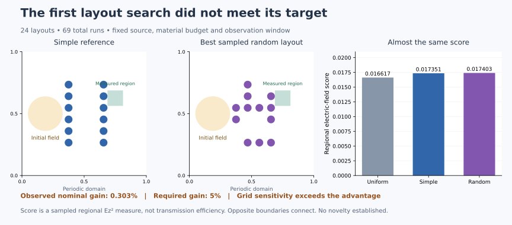

# A small dielectric configuration experiment

This is an **offline experiment artifact, not an app-importable recipe or a confirmed novel scientific finding**. It searches twenty-two reproducible random dielectric layouts and compares them with two fixed simple layouts using GENChase's maintained Maxwell update shaders. No AI model runs in this experiment. The uniform medium is a separate reference, outside the equal-material comparison.

The search asks whether the best random layout improves a fixed regional electric-field concentration score by at least 5% over the better simple layout, retains that margin under the stated held-out perturbations, and meets the stated grid/step sensitivity checks. A losing or grid-sensitive outcome is retained. This does not test whether AI outperforms another search method, establish an optimal layout, or claim that an experiment was impossible without AI.

## Reproduce or replay

Install the browser dependencies described in [BUILDING.md](../BUILDING.md), then run:

```sh
node tools/maxwell-search-check.js
node tools/maxwell-search.js > experiments/results/maxwell-search.json
node tools/maxwell-search.js --replay experiments/results/maxwell-search.json
node tools/maxwell-search.js --replay experiments/results/maxwell-search.json --grid 256
node tools/maxwell-search.js --replay experiments/results/maxwell-search.json --grid 256 --half-step
```

The full search result contains `candidate`, which is sufficient for nominal replay. It can also be saved as a standalone JSON object without the surrounding report. The record stores the exact occupied site indices, site coordinates as a fixed origin/spacing/count, cylinder radius and material values, initial field parameters, target rectangle, observation times, source SHA-256 and harness SHA-256. Replay rejects a changed Maxwell source revision or altered frozen settings. It runs the current maintained shader source; it does not execute code from JSON. Browser/backend details accompany each run.

## Frozen physical setup

The domain is the periodic square [0,1)² with permeability 1 and background permittivity 1. A 4-by-6 array supplies twenty-four possible rod centers:

`x = 0.375 + 0.09375 * column`, `y = 0.265625 + 0.09375 * row`.

Each candidate occupies exactly twelve sites with radius 0.03125 and permittivity 4. The simple layouts fill the two outer columns or alternate sites in a checkerboard. Random layouts use distinct fixed integer seeds beginning at 17001 and a deterministic shuffle. They receive the same nominal evaluation; no candidate is tuned after inspecting the held-out cases.

Every run starts from identical electric data and H(t=0)=0. At a point with displacement `(dx,dy)` from `(0.1875,0.5)`, let `q=(dx²+dy²)/0.14²`. The electric field is zero for q≥1; inside it is `exp(1 - 1/(1-q)) * cos(2π*4*dx + 0.17)`. Its compact support does not overlap any tested dielectric geometry, which also keeps the initial physical energy independent of the layout. The harness checks that separation. The magnetic half level is initialized with the actual Yee H pass at −dt/2.

This is a bidirectional initial-value problem in a **periodic** medium. Periodic returns are part of the specified model. There is no absorbing boundary, one-way illumination or transmission-efficiency claim. The result does not assert that all observations occur before wraparound.

A geometric inference helps explain the limited design leverage: the target center at x=0.75 is horizontally 0.4375 from the source through the left periodic boundary, compared with 0.5625 directly to the right. The finite-width, bidirectional packet may therefore contribute substantially through a path that bypasses the rods during the selected window. Transverse distance, pulse width and scattering also matter; this is **not a verified mechanism**. A larger domain or one-way source would constitute a separately specified follow-up, rather than a reason to retune this failed experiment after seeing its result.

## What the score measures

The target rectangle is x∈[0.6875,0.8125], y∈[0.5625,0.6875]. At physical times 0.300, 0.325, 0.350, 0.375, 0.400, 0.425 and 0.450, the harness reads raw float32 Ez and integrates Ez² over this rectangle. Partial cells at the boundary are weighted by their area. It divides the trapezoidal time average of these seven regional integrals by the whole-domain integral of the fixed initial Ez².

The score is **regional electric-field concentration**, not transmitted power, total electromagnetic energy, a detector response or display brightness. Magnetic energy and the dielectric factor are intentionally absent from this objective. Finite-time sampling is part of its definition; the result does not establish convergence of a continuous-time exposure integral. The separate conserved cross-time Yee energy is calculated with an independent CPU expression as a numerical rejection check, and is not the score.

The search runs at 128² cells with a step no larger than 0.6 of the vacuum CFL bound. The step is adjusted to hit the same physical sample times exactly. Nonfinite fields, a zero initial electric norm, changed material values, or cross-time energy drift above 10⁻⁴ reject a simulation. A deliberately blank source and a reversed electric-curl update must be rejected; a potentially huge score from the broken solver is not accepted as a discovery.

## Held-out cases and numerical sensitivity

After nominal selection, the best random and best simple layout are frozen. Each receives all twelve single-rod deletions and four previously unused perturbations: two position-jitter seeds, a slightly larger/lower-index case, and a slightly smaller/higher-index case. The perturbation values and seeds are saved in every run. The mean across four perturbations is a descriptive finite-set average, not a population estimate or confidence interval. The deletion score is an exact minimum over twelve discrete deletions at the search resolution.

Each finalist's nominal case and its worst deletion **as selected at 128²** are repeated at 256² and 512², keeping the physical geometry, initial data and observation times fixed. The 256² nominal case is also repeated with half the step. This checks sensitivity; it does not establish an order of convergence for discontinuous interfaces. A different deletion could become worst on a finer grid, because only the coarse-grid worst deletion is refined.

The frozen hypothesis requires at least 5% improvement in nominal score at 128² and 512², worst-deletion score at 128² and mean held-out-perturbation score at 128². Both finalists must have ≤5% score change between 256² and 512² for nominal/coarse-worst-deletion cases, and ≤1% nominal change on halving the 256² step. These are experiment thresholds, not universal accuracy tolerances. If a requirement fails, `hypothesis.supportedWithinThisFiniteTest` is false and the specific failure remains in the artifact.



## Read the result honestly

[The complete result](results/maxwell-search.json) gives the best random, best simple and uniform-reference scores in `summary`; all twenty-four tested layouts and their scores in `screening`; the failure controls; and every held-out and refinement run in `verification`. Scores against the uniform reference are shown even if the material configurations are worse than the free wave. Saving a candidate does not mean it won the hypothesis test.

The recorded first run used float32 SwiftShader and 69 forward solves. **The 5% improvement hypothesis failed.**

| Configuration | Score at 128² | Score at 256² | Score at 512² |
|---|---:|---:|---:|
| Best random, `random-17014` | 0.01740318 | 0.01776598 | 0.01785686 |
| Best simple, two outer columns | 0.01735055 | 0.01771319 | 0.01780561 |
| Uniform medium, separate reference | 0.01661741 | Not run | Not run |

The random candidate exceeded the simple layout by only 0.303% at the search grid and 0.288% at 512². Worst-deletion and mean held-out-perturbation improvements at 128² were 0.696% and 0.263%. Both finalists changed by about 0.51% between 256² and 512², larger than their nominal difference, so these results do not establish a meaningful advantage. Halving the 256² step changed nominal scores by about 0.105%. The blank source and wrong-curl controls were rejected. All other simulations met the stated finite-field/material/energy checks. None of those checks turns the losing search into a discovery.

Historical originality and independent Meep verification remain outstanding. Interface rasterization, quadrature, other devices, different physical windows and general parameter robustness have not been certified. For context, [Bor, Turduev and Kurt (2016)](https://www.nature.com/articles/srep30871) already optimized dielectric-cylinder arrangements with TMz FDTD, and the [official Meep adjoint examples](https://github.com/NanoComp/meep/blob/master/doc/docs/Python_Tutorials/Adjoint_Solver.md) already implement worst-case photonic design objectives. This experiment is a small reproducible configuration search within that established field.

The [boundary follow-up](MAXWELL-BOUNDARY.md) shows that enlarging the horizontal domain reverses the two finalists' ranking. It supports a periodic-boundary contamination diagnosis for this scoring window, not a new physical law.
